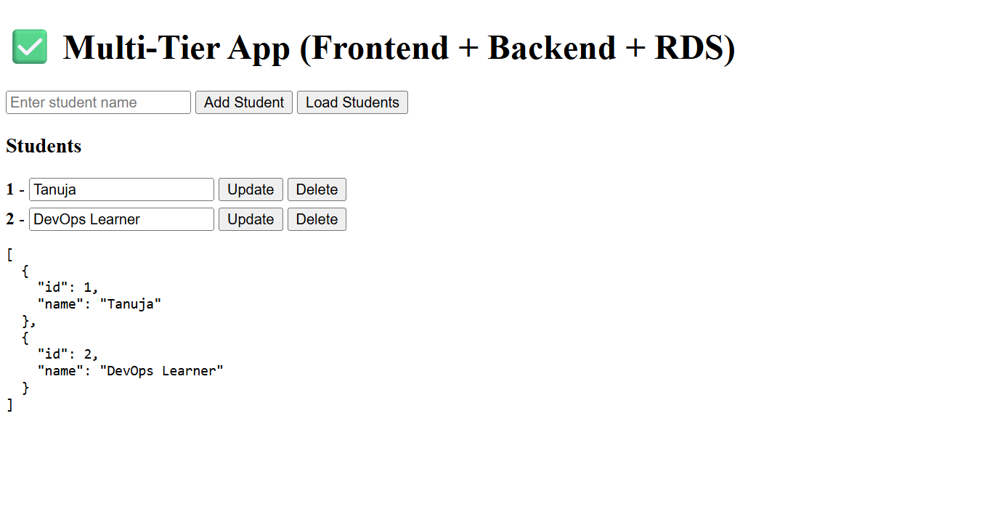
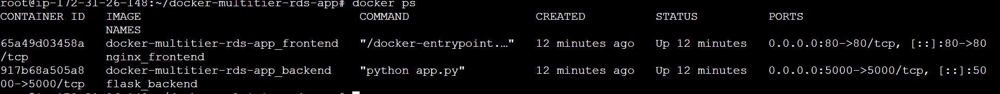
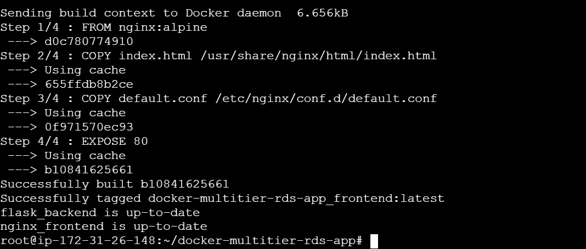
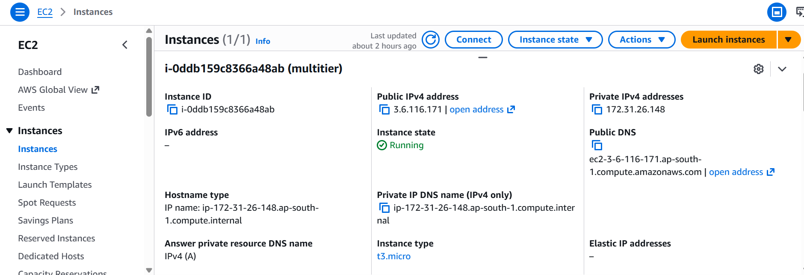
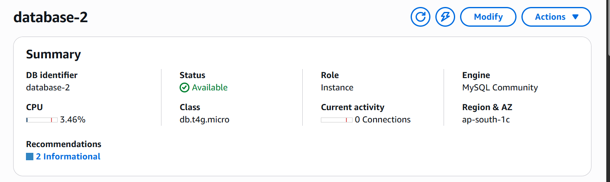
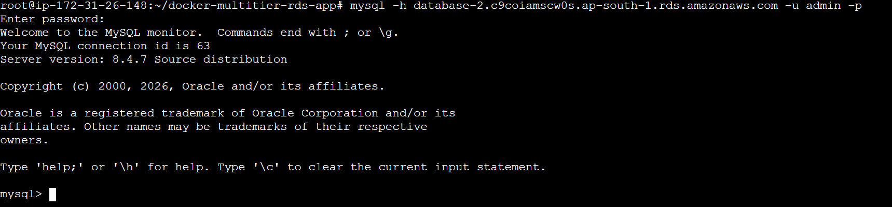
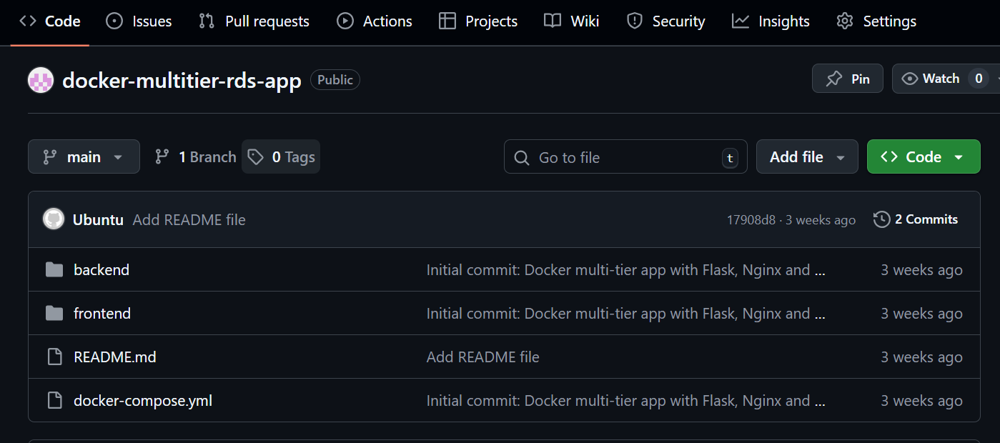

# 🚀 Docker Multi-Tier Application (Frontend + Backend + AWS RDS)

This project demonstrates a **3-tier web application** deployed on AWS EC2 using Docker Compose.

---

## 🏗️ Architecture

User → Nginx (Frontend) → Flask API (Backend) → AWS RDS MySQL

---

## ⚙️ Tech Stack

AWS EC2 | AWS RDS | Docker | Docker Compose | Nginx | Flask

---

## ✨ Features

* Add, view, update, delete students
* Backend connected to AWS RDS
* Nginx reverse proxy
* Fully containerized application

---

## 🚀 How to Run

```bash
git clone https://github.com/Tanu-25995/docker-multitier-rds-app.git
cd docker-multitier-rds-app
docker compose up -d --build
```

Open in browser:
http://<EC2_PUBLIC_IP>/

---

## 🛢️ Database Setup (if needed)

```bash
mysql -h <RDS_ENDPOINT> -u admin -p
```

```sql
CREATE DATABASE appdb;
```

---

## 📸 Screenshots

Application UI


Docker Containers


Docker Compose Run


EC2 Instance


RDS Database


MySQL Connection


GitHub Repository


---

## 📝 Notes

Docker Compose runs frontend and backend, while database is hosted on AWS RDS.
